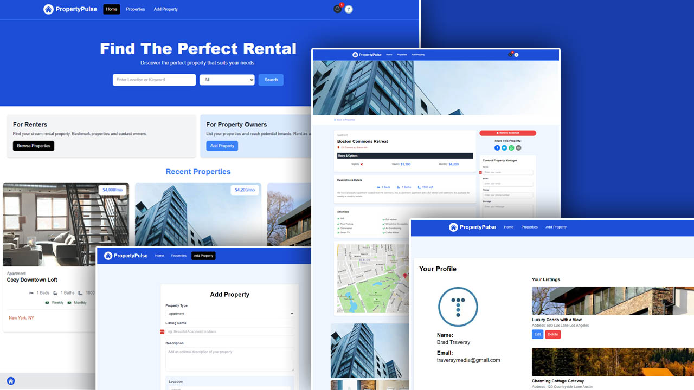

# PropertPulse

A full-stack real estate application built with **Next.js**, **NextAuth**, and **MongoDB**. The app allows users to authenticate via **Google** or **email and password**. Logged-in users can add property details and share them with others, making it a platform for managing and exploring real estate properties.



---

## Features

- **User Authentication**:

  - Sign in with Google.
  - Sign up and sign in with email and password.

- **Property Management**:

  - Add, edit, and delete your own shared property listings.
  - View shared property details.

- **Tech Stack**:
  - **Frontend**: Next.js.
  - **Backend**: Next.js API routes.
  - **Database**: MongoDB.
  - **Authentication**: NextAuth.

---

## Installation and Setup

### Prerequisites

- [Node.js](https://nodejs.org/) (v16 or higher)
- [MongoDB](https://www.mongodb.com/)
- [Google Cloud Console](https://console.cloud.google.com/) account for OAuth credentials.

### Steps

0. **Note**
   Rename the example.env file to just .env and provide the all env variable.

1. **Clone the repository**

   ```bash
   git clone https://github.com/UzairKhan313/next-js-property-pulse.git
   cd mern-instagram-clone
   ```

2. **Install the Dependecies r**

```bash
  npm install
```

3. **Run the project**

```bash
  npm run dev
```

## Contact me

Email: [uzairkhaan2003@gmail.com](mailto:uzairkhaan2003@gmail.com)
